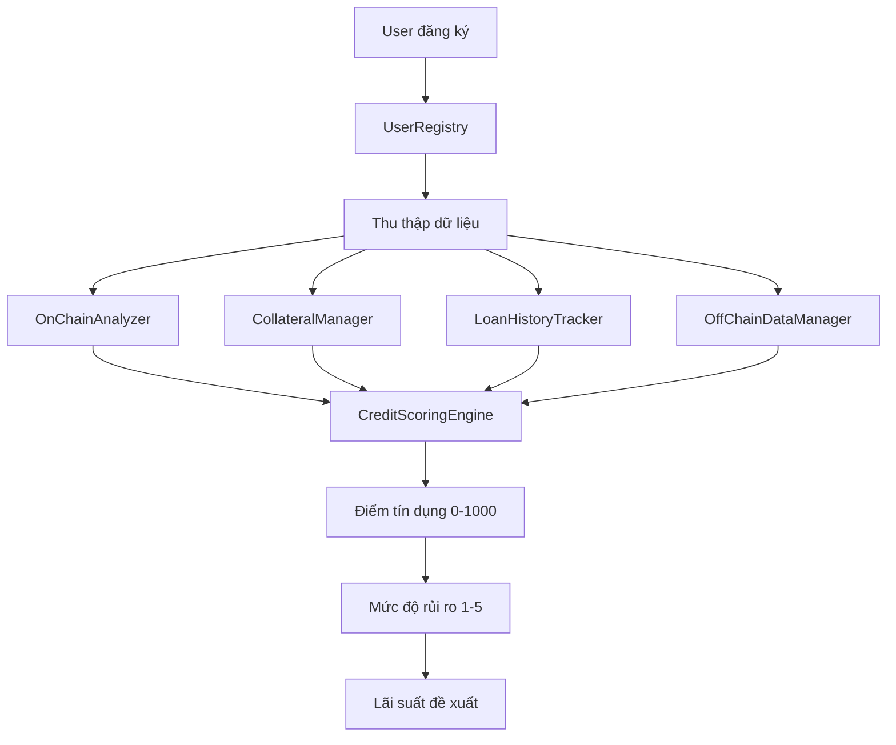

# Crypto Credit Scoring System

## 📋 Tổng quan

Hệ thống **Crypto Credit Scoring System** là một nền tảng DeFi toàn diện cho việc đánh giá tín dụng dựa trên blockchain. Hệ thống tích hợp nhiều nguồn dữ liệu khác nhau để tạo ra điểm tín dụng từ 0-1000, tương tự như FICO score trong tài chính truyền thống.

## 🎯 Mục tiêu chính

- **Đánh giá tín dụng toàn diện**: Kết hợp dữ liệu on-chain, off-chain, tài sản thế chấp và lịch sử vay nợ
- **Minh bạch và phi tập trung**: Tất cả logic tính toán được lưu trữ trên blockchain
- **Hỗ trợ DeFi lending**: Cung cấp điểm tín dụng để các giao thức lending đưa ra quyết định
- **Quản lý rủi ro**: Phân loại người dùng theo 5 mức độ rủi ro và đề xuất lãi suất phù hợp

## 🏗️ Kiến trúc hệ thống

```
┌─────────────────────────────────────────────────────────────┐
│                 CreditScoringEngine (Main)                  │
│                     Tổng hợp tất cả                         │
└─────────────────┬─────────────┬─────────────┬───────────────┘
                  │             │             │
        ┌─────────▼──────┐  ┌───▼────┐  ┌─────▼──────────┐
        │ OnChainAnalyzer│  │Collateral│  │LoanHistoryTracker│
        │   (35%)        │  │Manager   │  │    (25%)       │
        │                │  │ (25%)    │  │                │
        └────────────────┘  └─────────┘  └────────────────┘
                                │
                    ┌───────────▼──────────┐
                    │ OffChainDataManager  │
                    │        (15%)         │
                    └──────────────────────┘
```

## 📂 Cấu trúc thư mục

```
contracts/
├── core/                     # Smart contracts cốt lõi
│   ├── UserRegistry.sol      # Đăng ký & quản lý người dùng
│   ├── CreditScoringEngine.sol # Động cơ tính điểm chính
│   └── CreditDataTypes.sol   # Định nghĩa struct và enum
├── analyzers/                # Phân tích dữ liệu
│   └── OnChainAnalyzer.sol   # Phân tích dữ liệu on-chain
├── managers/                 # Quản lý các loại dữ liệu
│   ├── CollateralManager.sol     # Quản lý tài sản thế chấp
│   ├── LoanHistoryTracker.sol    # Theo dõi lịch sử vay
│   └── OffChainDataManager.sol   # Dữ liệu bên ngoài
├── interfaces/               # Định nghĩa interface
│   └── IOracle.sol          # Interface cho price oracle
├── libraries/                # Thư viện hỗ trợ
│   └── CreditMath.sol       # Các hàm toán học
└── mocks/                   # Contract giả cho testing
    ├── MockERC20.sol
    └── MockOracle.sol
```

## 🔧 Các thành phần chính

### 1. UserRegistry.sol
**Chức năng**: Đăng ký và quản lý người dùng
- ✅ Đăng ký với Digital Identity (DID)
- ✅ Xác minh danh tính
- ✅ Quản lý thông tin profile
- ✅ Role-based access control

### 2. OnChainAnalyzer.sol
**Chức năng**: Phân tích hoạt động on-chain (Trọng số: 35%)
- 📊 Số lượng giao dịch (15%)
- 💰 Tổng volume giao dịch (20%) 
- 🌊 Cung cấp thanh khoản (15%)
- 🔒 Staking amount (15%)
- 🗳️ Tham gia governance (10%)
- 📝 Tương tác smart contract (10%)
- ⏰ Tuổi tài khoản (10%)
- 🔄 Hoạt động gần đây (5%)

### 3. CollateralManager.sol
**Chức năng**: Quản lý tài sản thế chấp (Trọng số: 25%)
- 💎 Gửi/rút tài sản thế chấp
- 💲 Định giá qua price oracle
- 📈 Tính điểm dựa trên giá trị và đa dạng
- ⚠️ Quản lý ngưỡng thanh lý

### 4. LoanHistoryTracker.sol
**Chức năng**: Theo dõi lịch sử vay nợ (Trọng số: 25%)
- 📝 Ghi nhận khoản vay
- ✅ Theo dõi trả nợ
- ❌ Ghi nhận vỡ nợ
- 📊 Tính điểm dựa trên tỷ lệ trả nợ

### 5. OffChainDataManager.sol
**Chức năng**: Tích hợp dữ liệu bên ngoài (Trọng số: 15%)
- 🆔 KYC score (40%)
- 👥 Social media score (30%)
- 💼 Employment score (30%)
- ⏰ Áp dụng penalty cho dữ liệu cũ

### 6. CreditScoringEngine.sol
**Chức năng**: Tổng hợp tất cả để tính điểm cuối cùng
- 🔢 Tính điểm tổng hợp (0-1000)
- 📊 Xác định mức độ rủi ro (1-5)
- 💸 Đề xuất lãi suất
- ⏸️ Khả năng tạm dừng khẩn cấp

## 📊 Thang điểm tín dụng

| Điểm số | Mức độ rủi ro | Mô tả | Lãi suất đề xuất |
|---------|---------------|-------|------------------|
| 800-1000 | Very Low (1) | Excellent | 3-5% |
| 650-799 | Low (2) | Good | 5-8% |
| 500-649 | Medium (3) | Fair | 8-12% |
| 300-499 | High (4) | Poor | 12-18% |
| 0-299 | Very High (5) | Very Poor | 18%+ |

## 🔄 Luồng hoạt động



## 🚀 Hướng dẫn triển khai

### Yêu cầu hệ thống
- Node.js >= 16.0.0
- Hardhat
- Solidity ^0.8.19

### Cài đặt

```bash
# Clone repository
git clone https://github.com/your-repo/crypto-credit-scoring-system
cd crypto-credit-scoring-system

# Cài đặt dependencies
npm install

# Compile contracts
npx hardhat compile

# Chạy tests
npx hardhat test

# Deploy lên local network
npx hardhat node
npx hardhat run scripts/deploy.js --network localhost
```

### Cấu hình môi trường

```bash
# .env
PRIVATE_KEY=your_private_key
INFURA_PROJECT_ID=your_infura_id
ETHERSCAN_API_KEY=your_etherscan_key
```

## 🔐 Bảo mật và Quyền hạn

### Roles được định nghĩa
- **DEFAULT_ADMIN_ROLE**: Quản trị viên hệ thống
- **VERIFIER_ROLE**: Xác minh người dùng
- **ANALYZER_ROLE**: Phân tích dữ liệu on-chain
- **LOAN_MANAGER_ROLE**: Quản lý khoản vay
- **DATA_PROVIDER_ROLE**: Cung cấp dữ liệu off-chain

### Biện pháp bảo mật
- ✅ Reentrancy protection
- ✅ Access control với OpenZeppelin
- ✅ Pausable contracts
- ✅ Input validation
- ✅ Safe math operations

## ⚠️ Rủi ro và hạn chế

### Rủi ro đã xác định
- **Oracle manipulation**: Phụ thuộc vào price oracle bên ngoài
- **Centralization**: Một số vai trò có quyền hạn lớn
- **Data quality**: Chất lượng điểm số phụ thuộc vào dữ liệu đầu vào
- **Smart contract risk**: Bugs trong code có thể ảnh hưởng toàn hệ thống

### Biện pháp giảm thiểu
- Sử dụng multiple oracles
- Implement timelock cho admin functions
- Regular security audits
- Comprehensive testing

## 🧪 Testing

### Chạy test suite

```bash
# Test tất cả
npx hardhat test

# Test specific file
npx hardhat test test/UserRegistry.test.js

# Coverage report
npx hardhat coverage
```

### Test cases bao gồm
- ✅ User registration và verification
- ✅ On-chain data analysis
- ✅ Collateral management
- ✅ Loan history tracking
- ✅ Credit score calculation
- ✅ Access control
- ✅ Edge cases và error handling

## 📈 Roadmap phát triển

### Phase 1: Core Implementation ✅
- Basic credit scoring engine
- User management
- On-chain analysis
- Collateral management

### Phase 2: Advanced Features 🚧
- Machine learning integration
- Multi-chain support
- Advanced analytics dashboard
- API for third-party integration

### Phase 3: Enterprise Ready 📋
- Institutional features
- Regulatory compliance
- Advanced risk models
- Real-time monitoring

## 🤝 Đóng góp

Chúng tôi hoan nghênh mọi đóng góp! Vui lòng:

1. Fork repository
2. Tạo feature branch (`git checkout -b feature/AmazingFeature`)
3. Commit changes (`git commit -m 'Add some AmazingFeature'`)
4. Push to branch (`git push origin feature/AmazingFeature`)
5. Mở Pull Request

### Coding Standards
- Solidity style guide
- Comprehensive documentation
- Test coverage > 90%
- Gas optimization

## 📄 License

Dự án này được phân phối dưới giấy phép MIT. Xem file `LICENSE` để biết thêm chi tiết.

## 📞 Liên hệ

- **Email**: contact@crypto-credit-scoring.com
- **Telegram**: @CreditScoringSupport
- **Discord**: CreditScoring#1234

## 📚 Tài liệu tham khảo

- [OpenZeppelin Contracts](https://docs.openzeppelin.com/contracts/)
- [Hardhat Documentation](https://hardhat.org/docs)
- [Solidity Documentation](https://docs.soliditylang.org/)
- [DeFi Credit Scoring Best Practices](https://defi-credit-best-practices.com)

---

**⚡ Powered by Blockchain Technology | Built with ❤️ for DeFi Community**